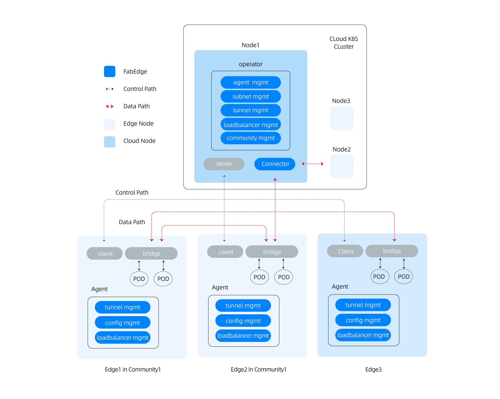

# FabEdge

  

FabEdge是一款基于kubernetes构建的，专注于边缘计算场景的容器网络方案，支持KubeEdge/SuperEdge/OpenYurt等主流边缘计算框架。 FabEdge解决了边缘计算场景下容器网络配置管理复杂，网络割裂互不通信，缺少服务发现、拓扑感知能力，无法提供就近访问等问题，使能云边、边边之间的业务协同。FabEdge支持弱网环境，如4/5G，WiFi，LoRa等，适用于物联网，车联网、智慧城市、智慧园区等场景。

## 特性

* **自动地址管理**：自动管理边缘节点网段，自动管理边缘容器IP地址。
* **云边、边边协同**: 建立云边，边边安全隧道，使能云边，边边之间的业务协同。  
* **灵活的隧道管理**:  使用自定义资源“社区”，可以根据业务需要灵活控制边边隧道。
* **拓扑感知路由**: 使用最近的可用端点，减少服务访问延时。

## 优势

* **标准**: 兼容K8S CNI规范，适用于任何协议，任何应用 。
* **安全**: 使用成熟稳定的IPSec技术，使用安全的证书认证体系。 
* **易用**: 使用Operator机制，自动管理地址，节点，证书等，最大程度减少人为干预。

## 工作原理

* KubeEdge等边缘计算框架建立了控制面，把边缘节点加入云端K8S集群，使得可以在边缘节点上下发Pod等资源；FabEdge在此基础上建立了一个三层的数据转发面，使得Pod和Pod之间可以直接通讯。
* 云端可以是任何K8S集群，目前支持的CNI包括Calico， Flannel。
* FabEdge使用安全隧道技术，目前支持IPSec。
* FabEdge包括三个主要的组件：Operators, Connector和Agent
* Operator运行在云端任意的节点，通过监听节点，服务等K8S资源，为每个Agent维护一个ConfigMap，包括了本Agent需要的路由信息，比如子网，端点，负载均衡规则等，同时为每个Agent维护一个Secret，包括CA证书，节点证书等。Operator也负责Agent自身的管理，包括创建，更新，删除等。
* Connector运行在云端选定的节点，负责管理从边缘节点发起的隧道，在边缘节点和云端集群之间转发流量。从Connector节点到云端其它非Connector节点的流量转发仍然依靠云端CNI。
* FabEdge使用社区里已有的网络插件bridge和host-local，负责Pod的虚拟网卡创建和地址分配。  
* Agent运行在每个边缘节点上， 它使用自己的ConfigMap和Secret的信息，发起到云端Connector和其它边缘节点的隧道，负责本节点的路由，负责均衡，iptables规则的管理。

## 兼容矩阵

|             | KubeEdge 1.8.0 | SuperEdge  0.5.0 | OpenYurt 0.5.0 |
| ----------- | -------------- | ---------------- | -------------- |
| FabEdge 0.3 | ✓              | ✓                | ✓              |

> 说明：
>
> 这里只包含了测试过的组合，并不是说其它的组合就不兼容。因为FabEdge并不严格依赖任何边缘计算框架，所以其它的主流版本大概率是可行的。

## FabEdge和其它CNI的关系 

FabEdge和现有的K8S CNI，比如Calico，Flannel，并不冲突。就像在前面架构图所示，Calico等传统的插件运行在云端K8S集群里，负责云内节点之间的流量转发，FabEdge作为它的一个补充，把网络的能力延伸到了边缘节点，使能了云边，边边通讯。

## 使用手册

请参考 [文档](docs/).

## 社区例会

双周例会（每个月的第一和第四周的周四下午） 

会议资料:  
[Meeting notes and agenda](https://shimo.im/docs/Wwt9TdGqgVvpDHJt)    
[Meeting recordings：bilibili channel](https://space.bilibili.com/524926244?spm_id_from=333.1007.0.0)  

## 联系方式

· 邮箱: fabedge@beyondcent.com  
· 扫描加入微信群

## 许可
FabEdge遵循Apache 2.0 许可。
