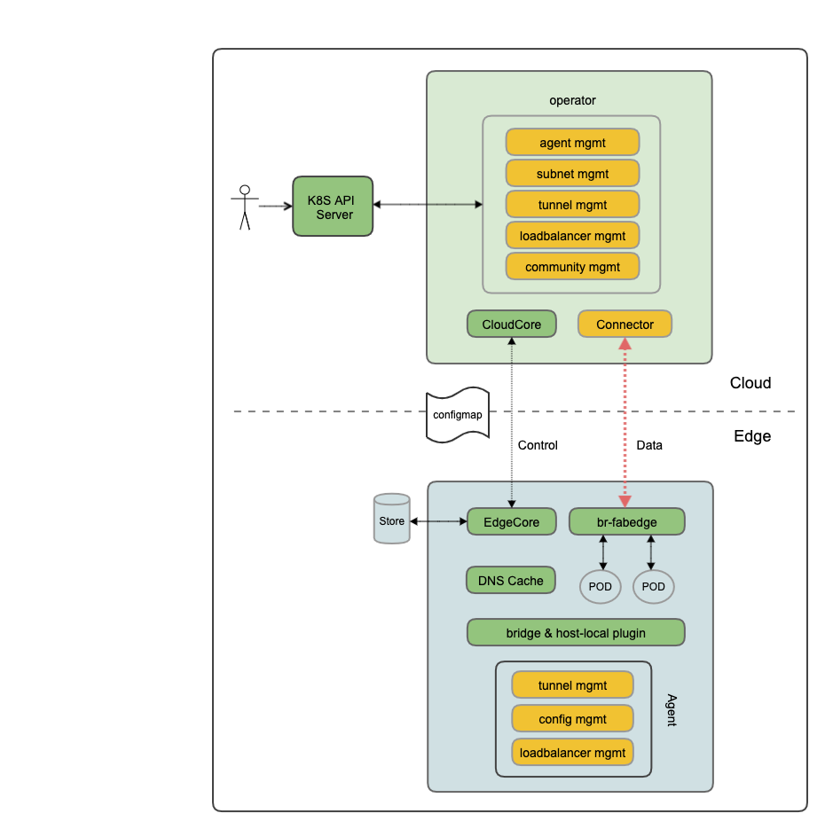

# fabric-edge设计

## 项目动因

边缘计算是在靠近物或数据源头的网络边缘侧，融合网络、计算、存储、应用核心能力的开放平台，就近提供边缘智能服务，满足行业数字化在敏捷联接、实时业务、数据优化、应用智能、安全与隐私保护等方面的关键需求。

物联网中的设备产生大量的数据，数据都上传到云端进行处理， 会对云端造成巨大的压力， 为分担中心云节点的压力，边缘计算节点可以负责自己范围内的数据计算和存储工作。但是经过处理的数据仍需要从边缘节点汇聚集中到中心云， 云计算做大数据分析挖掘、数据共享，同时进行算法模型的训练和升级，升级后的算法推送到前端，使前端设备更新和升级，完成自主学习闭环。

## 应用场景

- 工业互联网的边缘与云协同工作,在边缘计算环境中安装和连接的智能设备能够处理关键任务数据并实时响应，而不是通过网络将所有数据发送到云端并等待云端响应。设备本身就像一个迷你数据中心，由于基本分析正在设备上进行，因此延迟几乎为零。利用这种新增功能，数据处理变得分散，网络流量大大减少。云端可以在以后收集这些数据进行第二轮评估，处理和深入分析。
- 车联网领域里车路协同是采用先进的无线通信和互联网等技术，全方位实施车车（V2V）、车路（V2I）动态实时信息交互，并在全时空动态交通信息采集与融合的基础上开展车辆主动安全控制和道路协同管理，充分实现人车路的有效协同，保证交通安全，提高通行效率，从而形成的安全、高效和环保的道路交通系统。

## 项目目标

针对云边协同，边边协同等边缘计算领域的网络需求，提供一套安全，易用的边缘网络解决方案，fabedge。

## 前提和假设

1. 针对弱网环境，边缘节点使用4/5G等无线网络，没有固定IP地址，离线是常态。

2. 边缘节点资源有限，内存一般小于1GiB。

3. 基于公网传输，需要平台提供数据加密等安全保障。

4. 依赖kubernetes, kubeedge，linux等开源项目

## 架构图
- fabedge 利用两个通道实现云边数据交换，一个是kubeedge管理的websock通道，用于控制信令；令一个是fabedge管理的加密隧道，用于应用之间的数据传输。
- operator在云端监听node，service，endpoint等k8s资源，为每个边缘节点生成一个configmap，包含本节点子网，隧道，负载均衡等相关配置信息。同时operator负责为每个边缘节点生成相应的pod，用于启动本节点上的agent。
- connector负责终结到边缘节点加密隧道，在云和边缘节点进行流量转发。它依赖云端CNI插件将流量转发到connector以外的节点，目前支持callico。
- 边缘节点使用社区CNI插件，bridge 和 host-local。
- 边缘节点使用社区node-local-dns功能，负责本节点的域名解析和缓存。
- 每个边缘节点运行一个agent，消费本节点对应configmap，包括以下功能：
  - 管理本节点CNI插件的配置文件。
  - 管理本节点安全隧道。
  - 管理本节点的负载均衡信息，会优先使用本地服务后端，其次使用云端后端。

