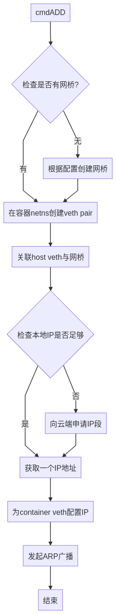

# edge-cni design

edge-cni responsible for container network management of edge nodes

1. The IPSec configuration is generated.
2. Container network management.

## 1. The IPSec configuration is generated

IPSecIt is used to solve cloud side communication and edge side communication.

 * The edge node communicates with the cloud through a route in the cloud, which requires the edge to configure corresponding pipes.
 *  Edge-side communication assumes that the nodes that need to communicate belong to the same community, so the nodes that belong to the same community will have a `fabedge/edge-community`, and each edge will be configured with pipes to the nodes of the same community. If a node does not have a `bocloud.com/edge-community` label, it cannot communicate with other edge nodes. 

Due to the instability of edge nodes, nodes may quit or join at any time, and the IP of nodes may change at any time. Therefore, each edge node needs to set up a service, which will monitor the node information changes of its own node and the community where the node resides, and generate IPSec configuration according to the latest information.

## 2. Container network management

When `edgecore` creates a Pod on an edge node, the `edge-cni plug-in` is called to add the container to the network. When the Pod is deleted, the `edge-cni plug-in` needs to be called to retrieve or destroy the previously allocated resource.

### Join the network

1. Check whether the local IP address segment is sufficient. If the local IP address segment is insufficient, apply for a new IP address segment from the cloud center.
2. Create a network bridge on the node.
3. Create a `veth pair` inside the container, add one of the `veth` pairs to the host namespace, and connect it to the network bridge.  
4. Check whether the local IP address resources are sufficient. If the local IP address resources are insufficient, apply for an IP address segment from the cloud. 
5. Obtain an IP address, assign an IP address to the container `venth`, and configure gateway and routing information.  
6. Initiate an ARP broadcast in the container to notify the subnet of the change in the mapping between the IP address and MAC address of other devices.  

### Exit network

1. Delete the container veth
2. Reclaim the IP address

### Apply for and reclaim an IP network segment

* Application: `edge-cni` determines whether the local network segment is sufficient during execution. If not, `edge-cni` applies for a network segment from the cloud.  
* Reclaim: In order not to waste IP segments, a certain amount of reclaim capacity is required.  

In order to apply for and reclaim IP network segments, an `IPController` service needs to be implemented on the cloud. The service provides the network segment application function to edge nodes and records the mapping between nodes and network segments. If the edge node is not deregistered, the associated network segment will not be released, but only after the node is deregistered.  

*Note: Since the CNI plug-in is invoked by the startup process, to reduce unnecessary memory fluctuations, the bridge and IP allocation functions are implemented together.*