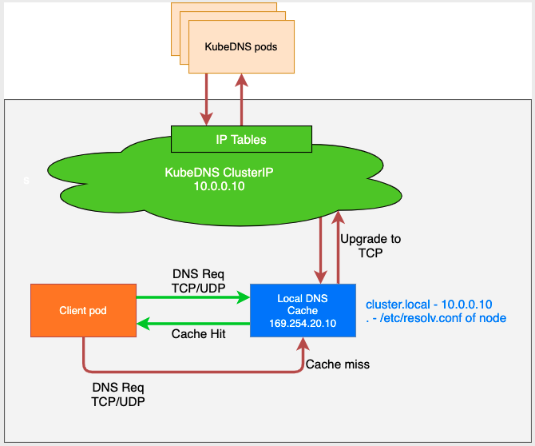

## Use [NodeLocal DNSCache](https://kubernetes.io/docs/tasks/administer-cluster/nodelocaldns/) with kubeedge

## Introduction

NodeLocal DNSCache improves Cluster DNS performance by running a dns caching agent on cluster nodes as a DaemonSet. In today's architecture, Pods in ClusterFirst DNS mode reach out to a kube-dns serviceIP for DNS queries. This is translated to a kube-dns/CoreDNS endpoint via iptables rules added by kube-proxy. With this new architecture, Pods will reach out to the dns caching agent running on the same node, thereby avoiding iptables DNAT rules and connection tracking. The local caching agent will query kube-dns service for cache misses of cluster hostnames(cluster.local suffix by default).

## Motivation

- With the current DNS architecture, it is possible that Pods with the highest DNS QPS have to reach out to a different node, if there is no local kube-dns/CoreDNS instance. Having a local cache will help improve the latency in such scenarios.
- Skipping iptables DNAT and connection tracking will help reduce conntrack races and avoid UDP DNS entries filling up conntrack table.
- Connections from local caching agent to kube-dns service can be upgraded to TCP. TCP conntrack entries will be removed on connection close in contrast with UDP entries that have to timeout (default `nf_conntrack_udp_timeout` is 30 seconds)
- Upgrading DNS queries from UDP to TCP would reduce tail latency attributed to dropped UDP packets and DNS timeouts usually up to 30s (3 retries + 10s timeout). Since the nodelocal cache listens for UDP DNS queries, applications don't need to be changed.
- Metrics & visibility into dns requests at a node level.
- Negative caching can be re-enabled, thereby reducing number of queries to kube-dns service.

## Architecture Diagram

This is the path followed by DNS Queries after NodeLocal DNSCache is enabled:




## Configuration

### NodeLocalDNS

```bash
root@node1:~/ght# kc get cm -n kube-system nodelocaldns
NAME           DATA   AGE
nodelocaldns   1      53d
```

- The local listen IP address for NodeLocal DNSCache can be any address that can be guaranteed to not collide with any existing IP in your cluster. It's recommended to use an address with a local scope, per example, from the link-local range 169.254.0.0/16 for IPv4 or from the Unique Local Address range in IPv6 fd00::/8.

- In kubernetes， If using kube-proxy in IPVS mode, `--cluster-dns` flag to kubelet needs to be modified to use `<node-local-address>` that NodeLocal DNSCache is listening on. 

### Kubeedge/edgecore

/etc/kubeedge/config/edgecore.yaml

```yaml
 edged:
    clusterDNS: "169.254.25.10"                # the local listen IP address of nodelocaldns
    clusterDomain: "cluster.local"						 # same as in kubelet
```

### CoreDNS

```bash
root@node1:~/ght# kc get cm -n kube-system coredns
NAME      DATA   AGE
coredns   1      53d
```

```yaml
Corefile: |
    .:53 {
        kubernetes cluster.local in-addr.arpa ip6.arpa {
          pods insecure
          ttl 3600        
          fallthrough in-addr.arpa ip6.arpa
        }
    }
```

ttl allows you to set a custom TTL for responses. The default is 5 seconds. The minimum TTL allowed is 0 seconds, and the maximum is capped at 3600 seconds. Setting TTL to 0 will prevent records from being cached.

**NOTE**  any response can NOT be cached longer than the TTL.

