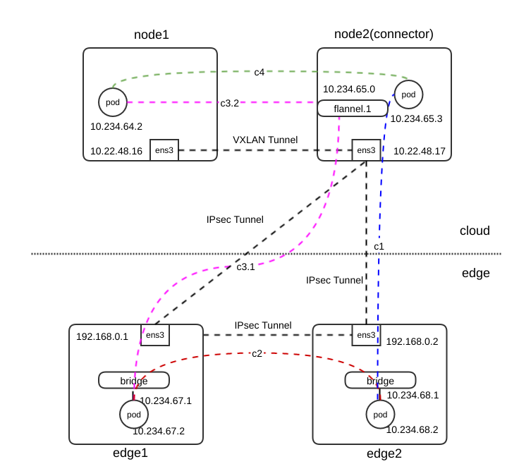
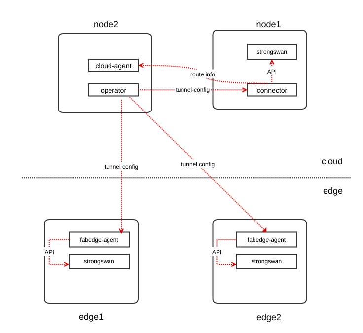

# FabEdge概要设计

[toc]

## 术语

* 云端节点：一个运行在云端的kubernetes节点，通常跟一群云端节点位于同一个数据中心，共享同一个网络，大多数Kubernetes管理组件也都运行在云端节点上
* 云端Pod：运行在云端节点的Pod
* 边缘节点：边缘节点是相对于云计算数据中心的节点，这些节点往往分布在不同的物理区域，跟云端节点位于不同的局域网，网络环境也较差，随时可能跟云端控制节点失联
* 边缘Pod：运行在边缘节点的Pod

## 概述

在边缘计算场景中，云边通信及边边通信是个常见的需求，但目前的边缘计算框架都尚未解决这个问题，FabEdge尝试解决这个问题。

FabEdge是一个边缘端工作的CNI实现，它并不替代Flannel, Calico等CNI实现，而是与这些CNI实现相互配合实现云边通信。在云端的通信依然由Flannel，Calico等CNI工具负责，FabEdge通过建立VPN隧道，配置iptables和路由，使得处于不同网络的Pod可以相互通信。

### 目标

* Pod之间通过IP地址可以相互访问
* 云端节点与边缘Pod之间通过IP地址可以相互访问
* 边缘节点与云端Pod之间通过IP地址可以相互访问
* 边缘Pod可以访问云端的Service(ClusterIP) 
* 云端Pod可以访问边端的Service(ClusterIP) 

## 解决方案

基本的原理很简单，在不同节点间建立双向VPN隧道，打通分布在不同区域的各个局域网，再配置路由和iptables，引导Pod发送的数据通过隧道到达目标节点上的Pod，这样就可以实现云边及边边通信。

云端的节点通常都在一个网络内，没必要都跟边缘节点建立隧道，所以云端会有一个被成为connector的节点，该节点充当云边的网关节点。

建立VPN隧道要消耗一定的资源，很多边缘场景边缘节点众多，如果每个节点都跟其他节点建立隧道，可能会消耗不必要的资源。为解决这个问题，需要有一种机制可以管网络拓扑，让有需要通信的节点可以相互通信。

建立隧道后，配置路由和规则后，Pod之间的通信只是成为了可能，因为一些限制，边缘节点不能运行Flannel和Calico的组件，所以FabEdge也要承担边缘Pod的IPAM工作。

综上所述，FabeEdge要解决如下问题：

* 建立云边和边边之间的双向VPN隧道，打通多个局域网
* 建立路由规则和iptables规则
* 管理边缘Pod的IP分配
* 管理边缘节点之间的通信


### VPN选择

在诸多VPN中我们选择了Strongswan，因为它可以通过vici协议来动态管理隧道的创建和销毁，部署的时候可以运行在单独的容器，而不是跟agent运行在同一个容器，通过信号来控制配置的加载。


### 路由规则和iptables规则

为方便理解，在此提供一张网络拓扑图，该集群有4个节点，其中node1, node2是云端节点，云端使用flannel通信，node2被选为connector节点； edge1，edge2是边缘节点，两个边缘节点可以直接通信。最后该集群的ServiceClusterIPRange为10.234.0.0/18。




#### 边缘节点

以edge1为例，FabEdge会在一个ID为220的路由表里创建路由，示例如下：

```
10.234.0.0/18 via 192.168.0.254 dev eth0 
10.234.64.0/24 via 192.168.0.254 dev eth0 
10.234.65.0/24 via 192.168.0.254 dev eth0 
10.234.68.0/24 via 192.168.0.254 dev eth0 .
```

192.168.0.254是edge1的默认网关，其他网段分别是ServiceCluserIPRange和分配给其他节点的PodCIDRs。从表面上看发向10.234.0.0/16的数据下一跳是192.168.0.254，但实际上会被strongswan拦截并通过建立的隧道发向不同的节点。

路由表220是由strongswan创建，其优先级也高于默认路由表:

```
0:	from all lookup local 
220:	from all lookup 220 
32766:	from all lookup main 
32767:	from all lookup default 
```

除了路由规则，还需要配置iptables规则，fabedge agent会在filter和nat表里定义如下规则:

filter table:

```
-N FABEDGE-FORWARD
-A FORWARD -j FABEDGE-FORWARD
-A FABEDGE-FORWARD -s 10.234.67.0/24 -j ACCEPT
-A FABEDGE-FORWARD -d 10.234.67.0/24 -j ACCEPT
```

nat table:

```
-N FABEDGE-NAT-OUTGOING
-A POSTROUTING -j FABEDGE-NAT-OUTGOING
-A FABEDGE-NAT-OUTGOING -s 10.234.67.0/24 -m set --match-set FABEDGE-PEER-CIDR dst -j RETURN
-A FABEDGE-NAT-OUTGOING -s 10.234.67.0/24 -d 10.234.67.0/24 -j RETURN
-A FABEDGE-NAT-OUTGOING -s 10.234.67.0/24 -j MASQUERADE
```

其中10.234.67.0/24是分配给edge1的PodCIDR，filter表里的规则确保源地址及目标地址为这个网段的数据可以被转发，nat表里的规则确保边缘Pod访问外网时会被地址转换，访问其他Pod和服务时则不会。

 FABEDGE-PEER-CIDR是一个ipset，里面的地址都是其他节点的地址，PodCIDR及ServcieClusterIPRange

```
Name: FABEDGE-PEER-CIDR
Type: hash:net
Revision: 6
Header: family inet hashsize 1024 maxelem 65536
Size in memory: 952
References: 1
Number of entries: 9
Members:
10.234.65.0/24
10.22.48.17
10.234.64.0/24
10.234.0.0/18
10.22.48.16
192.168.0.2
10.234.68.0/24
```

#### connector节点

FabEdge同样会在路由表220里创建一些路由:

```
10.234.67.0/24 via 10.22.48.254 dev eth0 
10.234.68.0/24 via 10.22.48.254 dev eth0 
```

10.234.67.0/24及10.234.68.0/24是边缘节点的PodCIDRs，10.22.48.254是云端的默认网关，跟边缘端一样，发往边缘Pod的同样会被strongswan通过隧道发向边缘节点。

FabEdge不会修改connector节点的默认路由表，其内容如下:

```
default via 10.22.48.254 dev eth0 proto dhcp metric 100 
10.234.64.0/24 via 10.234.64.0 dev flannel.1 onlink 
10.234.65.0/24 dev cni0 proto kernel scope link src 10.234.65.1 
```

从上面可以看出，访问云端Pod的请求会被flannel处理。

下面是FabEdge在connector节点生成的iptables规则:

filter table:

```
-N FABEDGE-FORWARD
-N FABEDGE-INPUT
-A INPUT -j FABEDGE-INPUT
-A FORWARD -j FABEDGE-FORWARD
-A FABEDGE-FORWARD -m conntrack --ctstate RELATED,ESTABLISHED -j ACCEPT
-A FABEDGE-FORWARD -m set --match-set FABEDGE-CLOUD-POD-CIDR src -j ACCEPT
-A FABEDGE-FORWARD -m set --match-set FABEDGE-CLOUD-POD-CIDR dst -j ACCEPT
-A FABEDGE-FORWARD -m set --match-set FABEDGE-CLOUD-NODE-CIDR src -j ACCEPT
-A FABEDGE-FORWARD -m set --match-set FABEDGE-CLOUD-NODE-CIDR dst -j ACCEPT
-A FABEDGE-INPUT -p udp -m udp --dport 500 -j ACCEPT
-A FABEDGE-INPUT -p udp -m udp --dport 4500 -j ACCEPT
-A FABEDGE-INPUT -p esp -j ACCEPT
-A FABEDGE-INPUT -p ah -j ACCEPT
```

nat table:

```
-N FABEDGE-POSTROUTING
-A POSTROUTING -j FABEDGE-POSTROUTING
-A FABEDGE-POSTROUTING -m set --match-set FABEDGE-CLOUD-POD-CIDR src -m set --match-set FABEDGE-EDGE-POD-CIDR dst -j ACCEPT
-A FABEDGE-POSTROUTING -m set --match-set FABEDGE-EDGE-POD-CIDR src -m set --match-set FABEDGE-CLOUD-POD-CIDR dst -j ACCEPT
-A FABEDGE-POSTROUTING -m set --match-set FABEDGE-CLOUD-POD-CIDR src -m set --match-set FABEDGE-EDGE-NODE-CIDR dst -j ACCEPT
-A FABEDGE-POSTROUTING -m set --match-set FABEDGE-EDGE-POD-CIDR src -m set --match-set FABEDGE-CLOUD-NODE-CIDR dst -j MASQUERADE
-A FABEDGE-POSTROUTING -m set --match-set FABEDGE-EDGE-NODE-CIDR src -m set --match-set FABEDGE-CLOUD-POD-CIDR dst -j MASQUERADE
```

filter表的规则主要是确保strongswan和云端的数据不会被拒绝，nat表比较复杂：

* 云边Pod之间的通信不做NAT；
* 云端Pod与边缘节点的通信不做NAT；
* 边缘Pod访问云端节点时要做SNAT，避免rp_filter问题；
* 边缘节点访问云端Pod时要做SNAT，否则回包会找不到边缘节点。

#### 非connector的云节点

因为云端的隧道只有connector能建立，非connector节点的其他云节点访问边缘时需要将流量路由到connector节点，以node1为例，其路由规则如下:

```
10.234.67.0/24 via 10.234.65.0 dev flannel.1 onlink 
10.234.68.0/24 via 10.234.65.0 dev flannel.1 onlink 
```

这些规则依然创建在路由表220里，不过该表不再由strongswan创建，而是由fabedge-cloud-agent创建.10.234.65.0是connector节点的flannel.1设备的地址。

主表路由规则如下:

```
default via 10.22.48.254 dev eth0 proto dhcp metric 100 
10.22.48.0/24 dev eth0 proto kernel scope link src 10.22.48.16 metric 100 
10.234.64.0/24 dev cni0 proto kernel scope link src 10.234.64.1 
10.234.65.0/24 via 10.234.65.0 dev flannel.1 onlink 
10.234.66.0/24 via 10.234.66.0 dev flannel.1 onlink 
```

从两张表可以看出，FabEdge将访问边缘节点的流量都路由到connector节点的flannel.1网卡上，然后再通过strongswan创建的隧道访问边缘Pod。

### 边缘Pod IPAM

FabEdge没有像其他CNI实现开发自己的CNI插件，而是采用[CNI Plugins](https://github.com/containernetworking/plugins)提供的host-local, bridge, portmap, bandwith等插件，这些通用插件已经可以满足基本的IPAM功能。

fabedge-agent组件会在边缘端生成如下CNI配置

```
{
  "cniVersion": "0.3.1",
  "name": "fabedge",
  "plugins": [
    {
      "type": "bridge",
      "bridge": "br-fabedge",
      "isDefaultGateway": true,
      "forceAddress": true,
      "hairpinMode": true,
      "mtu": 1400,
      "ipam": {
        "type": "host-local",
        "ranges": [
          [
            {
              "subnet": "10.234.67.0/24"
            }
          ]
        ]
      }
    },
    {
      "type": "portmap",
      "capabilities": {
        "portMappings": true
      }
    },
    {
      "type": "bandwidth",
      "capabilities": {
        "bandwidth": true
      }
    }
  ]
}
```

#### 边缘节点PodCIDR分配

根据CNI实现的不同，有些场景下需要FabEdge承担边缘节点的PodCIDR分配，分配的PodCIDR会存储在边缘节点的annotations里，例如:

```
fabedge.io/subnets: 10.233.103.192/26
```

当前FabEdge仅支持Flannel和Calico两个CNI实现，使用Calico时需要额外提供一个网段供FabEdge分配PodCIDR。

### 边缘节点通信管理

我们提出了一个叫Community的CRD，用户可以利用Community管理节点之间的通信，只有位于同一个Community内的边缘Pod才可以通信。因为云边通信的需求比较频繁，所以云边之间默认建立隧道。

```
type Community struct {
	metav1.TypeMeta   `json:",inline"`
	metav1.ObjectMeta `json:"metadata,omitempty"`

	Spec CommunitySpec `json:"spec,omitempty"`
}

type CommunitySpec struct {
	Members []string `json:"members,omitempty"`
}
```

如下实例会创建一个名为all-edge-nodes的Community，让edge1, edge2两个节点通信，配置community时，使用的名称跟节点名不同，这里用的名称其实是端点名，一个端点名是由"集群名.节点名"组成的。

```
apiVersion: fabedge.io/v1alpha1
kind: Community
metadata:
  name: all-edge-nodes
spec:
  members:
    - beijing.edge1
    - beijing.edge2
```

### 服务访问

在解决方案里没有提到如何实现服务访问(ClusterIP类型)，因为有些场景下这不是个问题。

首先，云端Pod可以通过域名访问边缘服务，边缘Pod也可以访问任何云端服务；但边缘Pod访问边缘服务可以分为两种情况:

* 边缘端可以运行kube-proxy，这时只要边缘节点跟运行服务后端的边缘节点建立了隧道，就可以通过域名访问边缘服务；
* 边缘端不能运行kube-proxy，这时即便边缘节点跟运行服务后端的边缘节点建立隧道，甚至服务后端跟客户端Pod在同一个节点，也无法通信，因为域名解析出来的是ClusterIP，需要通过connector来中转，但connector并没有被设计承担这个功能。

针对第二种情况，FabEdge提供了一个名为fab-proxy的小组件，它可以让在同一个边缘节点的Pod通过域名访问后端在同一个节点的服务，但不支持跨节点的访问。

如果想更好访问边缘服务，最好还是让kube-proxy运行在边缘节点上。

## FabEdge组件说明



### fabedge-agent

fabedge-agent运行在边缘节点上，主要承担CNI配置生成，iptables，ipset, ipvs数据维护，路由表配置，strongswan隧道管理等功能。

### fabedge-connector

fabedge-connector运行在云端的特定节点上，主要负责connector节点的iptables，ipset, ipvs数据维护，路由表配置，strongswan隧道管理等功能，另外还负责向fabedge-cloud-agent传递一些路由信息

### fabedge-cloud-agent

fabedge-cloud-agent运行在云端的非connector节点，主要负责所在节点的iptables，ipset数据，路由表配置，fabedge-cloud-agent会从fabedge-connector获取一些路由信息。

### fabedge-opeartor

fabedge-operator承担了以下功能：

* 为每个边缘节点部署fabedge-agent；
* 在某些场景，为边缘节点分配PodCIDR；
* 为边缘节点和connector节点的strongswan生成证书和私钥；
* 为fabedge-agent和fabedge-connector管理隧道配置；
* 在开启fab-proxy特性的情况下，为fabedge-agent生成该节点的IPVS配置
