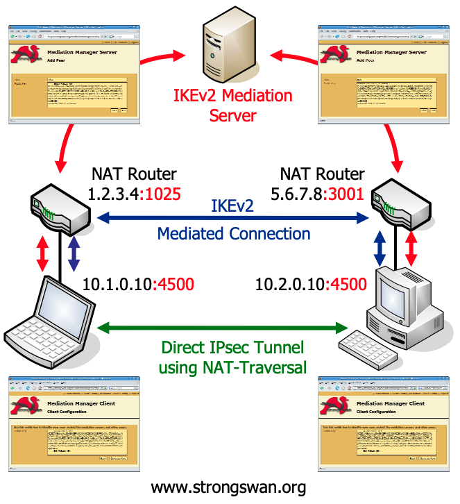

# strongswan mediation server

这个特性用于帮助两个位于NAT网关后面的设备建立直接的IPSec隧道，使用“udp hole punching”的技术。




## 实验环境

### 节点分配

- master1,  10.20.8.141, 作为mediation server， 同时也是fabedge connector

- edge1上跑了个容器， 模拟一个endpoint，通过NAT可以上网（环境有限， 不得已而为之）

- remote， 一个虚拟机， 通过NAT可以上网

### master1

```shell
# cat /etc/ipsec.secrets
root@master1:/etc# cat /etc/ipsec.secrets
"C=CN, O=Local Cluster, CN=cloud-connector" : RSA cloud-connector1.pem
"C=CN, O=Local Cluster, CN=cloud-connector2" : RSA cloud-connector2.pem

# cat /etc/ipsec.conf
config setup

conn %default
        ikelifetime=60m
        keylife=20m
        rekeymargin=3m
        keyingtries=1
        keyexchange=ikev2
        mobike=no

conn medsrv
        leftid="C=CN, O=Local Cluster, CN=cloud-connector"
        leftcert=cloud-connector1.pem
        leftfirewall=yes
        mediation=yes
        auto=add

conn remote
        leftid="C=CN, O=Local Cluster, CN=cloud-connector2"
        leftcert=cloud-connector2.pem
        rightid="C=CN, O=Local Cluster, CN=remote2"
        leftsubnet=10.233.97.0/24
        rightsubnet=7.7.8.0/24
        auto=add

conn proxy
        leftid="C=CN, O=Local Cluster, CN=cloud-connector2"
        leftcert=cloud-connector2.pem
        rightid="C=CN, O=Local Cluster, CN=proxy2"
        leftsubnet=6.1.1.0/24
        leftsubnet=6.1.2.0/24
        auto=add
```


```shell
root@master1:/etc# ipsec status
Security Associations (3 up, 0 connecting):
      remote[68]: ESTABLISHED 36 minutes ago, 10.20.8.141[C=CN, O=Local Cluster, CN=cloud-connector2]...10.40.20.153[C=CN, O=Local Cluster, CN=remote2]
      remote{85}:  INSTALLED, TUNNEL, reqid 22, ESP in UDP SPIs: c12c6d97_i c576348d_o
      remote{85}:   10.233.97.0/24 === 7.7.8.0/24
      medsrv[67]: ESTABLISHED 36 minutes ago, 10.20.8.141[C=CN, O=Local Cluster, CN=cloud-connector]...10.40.20.153[C=CN, O=Local Cluster, CN=remote]
      medsrv[66]: ESTABLISHED 38 minutes ago, 10.20.8.141[C=CN, O=Local Cluster, CN=cloud-connector]...10.20.8.139[C=CN, O=Local Cluster, CN=proxy]
```


### edge1

```shell
root@edge1:~# docker exec ipsec cat /etc/ipsec.secrets
"C=CN, O=Local Cluster, CN=proxy" : RSA proxy_key.pem
"C=CN, O=Local Cluster, CN=proxy2" : RSA proxy2_key.pem

root@edge1:~# docker exec ipsec cat /etc/ipsec.conf
config setup
conn %default
        ikelifetime=60m
        keylife=20m
        rekeymargin=3m
        keyingtries=1
        keyexchange=ikev2
        mobike=no
conn medsrv
        leftid="C=CN, O=Local Cluster, CN=proxy"
        leftcert=proxy_cert.pem
        rightid="C=CN, O=Local Cluster, CN=cloud-connector"

        right=10.20.8.141
        mediation=yes
        auto=start
conn peer
        leftid="C=CN, O=Local Cluster, CN=proxy"
        leftcert=proxy_cert.pem
        leftsubnet=7.7.7.0/24
        rightid="C=CN, O=Local Cluster, CN=remote"
        rightsubnet=7.7.8.0/24
        mediated_by=medsrv
        auto=start

conn cloud
        leftid="C=CN, O=Local Cluster, CN=proxy2"
        leftcert=proxy2_cert.pem
        rightid="C=CN, O=Local Cluster, CN=cloud-connector2"
        right=10.20.8.141
        rightsubnet=6.1.1.0/24
        leftsubnet=6.1.2.0/24
        auto=start
```


```shell
root@edge1:~# docker exec ipsec ipsec status
Security Associations (2 up, 0 connecting):
      medsrv[44]: ESTABLISHED 38 minutes ago, 172.17.0.2[C=CN, O=Local Cluster, CN=proxy]...10.20.8.141[C=CN, O=Local Cluster, CN=cloud-connector]
        peer[43]: ESTABLISHED 40 minutes ago, 172.17.0.2[C=CN, O=Local Cluster, CN=proxy]...10.40.20.153[C=CN, O=Local Cluster, CN=remote]
        peer{85}:  INSTALLED, TUNNEL, reqid 22, ESP in UDP SPIs: c1c79b49_i c3009db0_o
        peer{85}:   7.7.7.0/24 === 7.7.8.0/24
root@edge1:~#
```


### remote

```shell
root@remote:/home/ght# cat /etc/ipsec.secrets
# This file holds shared secrets or RSA private keys for authentication.

# RSA private key for this host, authenticating it to any other host
# which knows the public part.
"C=CN, O=Local Cluster, CN=remote" : RSA remote.pem
"C=CN, O=Local Cluster, CN=remote2" : RSA remote2.pem

root@remote:/home/ght# cat /etc/ipsec.conf
config setup
conn %default
        ikelifetime=60m
        keylife=20m
        rekeymargin=3m
        keyingtries=1
        keyexchange=ikev2
        mobike=no

conn medsrv
        leftid="C=CN, O=Local Cluster, CN=remote"
        leftcert=remote.pem
        leftsourceip=1.1.1.236
        rightid="C=CN, O=Local Cluster, CN=cloud-connector"
        right=10.20.8.141
        mediation=yes
        auto=start

conn peer
        leftid="C=CN, O=Local Cluster, CN=remote"
        leftcert=remote.pem
        rightsubnet=7.7.7.0/24
        rightid="C=CN, O=Local Cluster, CN=proxy"
        leftsubnet=7.7.8.0/24
        mediated_by=medsrv
        auto=start

conn cloud
        leftid="C=CN, O=Local Cluster, CN=remote2"
        leftcert=remote2.pem
        rightid="C=CN, O=Local Cluster, CN=cloud-connector2"
        right=10.20.8.141
        rightsubnet=10.233.97.0/24
        leftsubnet=7.7.8.0/24
        auto=start
```


```shell
root@remote:/home/ght# ipsec status
Security Associations (3 up, 0 connecting):
       cloud[63]: ESTABLISHED 35 minutes ago, 1.1.1.236[C=CN, O=Local Cluster, CN=remote2]...10.20.8.141[C=CN, O=Local Cluster, CN=cloud-connector2]
       cloud{166}:  INSTALLED, TUNNEL, reqid 42, ESP in UDP SPIs: c576348d_i c12c6d97_o
       cloud{166}:   7.7.8.0/24 === 10.233.97.0/24
      medsrv[62]: ESTABLISHED 35 minutes ago, 1.1.1.236[C=CN, O=Local Cluster, CN=remote]...10.20.8.141[C=CN, O=Local Cluster, CN=cloud-connector]
        peer[61]: ESTABLISHED 39 minutes ago, 1.1.1.236[C=CN, O=Local Cluster, CN=remote]...10.20.8.139[C=CN, O=Local Cluster, CN=proxy]
        peer{165}:  INSTALLED, TUNNEL, reqid 41, ESP in UDP SPIs: c3009db0_i c1c79b49_o
        peer{165}:   7.7.8.0/24 === 7.7.7.0/24
```


## 参考资料

- https://bsdrp.net/documentation/examples/strongswan_ipsec_mediation_feature

- https://www.questioncomputer.com/strongswan-ipsec-mediation-both-ubuntu-linux-20-04-peers-behind-cisco-nat/

- https://www.strongswan.org/docs/LinuxTag2008_Flyer_Mediation_Service.pdf
