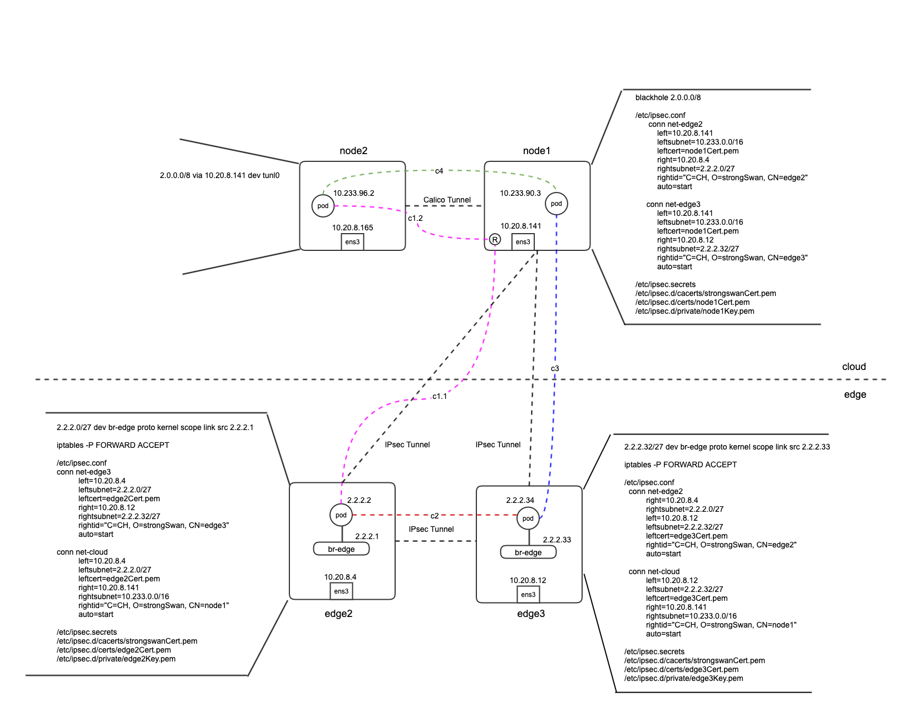

# POC of fabric-edge networking  


## 环境信息

复用现有edge开发环境： 10.20.8.141等

目的是在任何一个节点上，不论云或边， pod都能直接通讯。比如连接c2（2.2.2.2 <-> 2.2.2.34), c3(2.2.2.34<->10.233.90.3), c1(2.2.2.2<->10.233.96.2)有两段组c1.1和c1.2， c4(10.233.96.2<->10.233.90.3)是calico负责的事，和本设计无关。



## 安装strongswan软件

常用的IPsec软件有strongswan和libreswan，两者差不多，fabric-cloud使用的strongswan，我们也使用它。在每个**边缘节点**都需要安装，云端只需要在一个节点上安装，这里使用node1。

```bash
# 开发环境使用ubuntu 18.4/20.4
apt install strongswan-starter strongswan-pki

# 生成CA的密钥，证书，一个环境只需要一套。
cd /etc/ipsec.d/
ipsec pki --gen --type rsa --size 4096 --outform pem > private/strongswanKey.pem
ipsec pki --self --ca --lifetime 3650 --in private/strongswanKey.pem --type rsa --dn "C=CN, O=StrongSwan, CN=Root CA" --outform pem > cacerts/strongswanCert.pem

# 在CA的节点上给其它每个节点创建密钥，证书，然后复制到节点相应目录里。以edge2为例：
ipsec pki --gen --type rsa --size 2048 --outform pem > private/edge2Key.pem
chmod 600 private/edge2Key.pem

ipsec pki --pub --in private/edge2Key.pem --type rsa | ipsec pki --issue --lifetime 730 --cacert cacerts/strongswanCert.pem --cakey private/strongswanKey.pem --dn "C=CN, O=StrongSwan, CN=edge2" --san edge2 --flag serverAuth --flag ikeIntermediate --outform pem > certs/edge2Cert.pem

# 配置ipsec.secrets
# cat ipsec.secrets
: RSA edge2Key.pem
```


## 使用strongswan容器

Dockerfile如下：
```
FROM alpine

RUN apk --update add strongswan && \
    rm -rf /var/cache/apk/*

VOLUME /etc/ipsec.d /etc/strongswan.d

CMD ["/usr/sbin/ipsec", "start", "--nofork"]
```

启动容器：
```bash
docker run -d --net host --privileged \
       -v/etc/ipsec.conf:/etc/ipsec.conf \
       -v /etc/ipsec.d:/etc/ipsec.d \
       -v /etc/strongswan.d:/etc/strongswan.d \
       -v /etc/ipsec.secrets:/etc/ipsec.secrets \
       -v /var/run/charon:/var/run/charon \
       --name strongswan strongswan:5.9.1
```

**注意 ：vici socket位置变为：/var/run/charon/charon.vici**


## 网桥和虚拟网卡管理

每个**边缘节点**创建一个网桥用于连接容器

```bash
# 添加网桥
ip link add br-edge type bridge

# 给网桥配置地址，这个地址会是容器的网关
ip address a 2.2.2.1/27 dev br-edge
```

每创建一个容器，生成对应的veth，并连接到网桥

```bash
ip link add xxx type veth
ip l set xxx0 up
ip l set xxx0 master br-edge
# 1. 把对应的xxx1放入容器对应namespace
ip l set xxx1 netns ns1
# 2. 给xxx1配置ip地址
ip l set xxx1 up
ip a a 2.2.2.2/27 dev xxx1
ip r a default via 2.2.2.1
```

最终的效果如下：

```bash
# 在宿主机上查看：
# ip link show veth1
4: br-edge: <BROADCAST,MULTICAST,UP,LOWER_UP> mtu 1500 qdisc noqueue state UP mode DEFAULT
8: veth1@if7: <BROADCAST,MULTICAST,UP,LOWER_UP> mtu 1500 qdisc noqueue master br-edge state UP mode DEFAULT 

# 在容器里查看：
# ip link
7: veth0@if8: <BROADCAST,MULTICAST,UP,LOWER_UP> mtu 1500 qdisc noqueue state UP group default qlen 1000
    inet 2.2.2.2/27 scope global veth0
# ip r
default via 2.2.2.1 dev veth0
2.2.2.0/27 dev veth0 proto kernel scope link src 2.2.2.2
```


## IPsec隧道管理

通过修改strongswan的配置文件/etc/ipsec.conf，配置相应的隧道。 一个是边缘节点到云端的隧道， 另外是本边缘节点到其他边缘节点的隧道，以edge2为例：

```
conn net-edge3  #到另外边缘节点
          left=10.20.8.4           									#自己的出口地址
          leftsubnet=2.2.2.0/27    									#自己上面容器用到的网段
          leftcert=edge2Cert.pem   									#自己的证书
          right=10.20.8.12         									#对端的地址
          rightsubnet=2.2.2.32/27  									#对端的网段
          rightid="C=CN, O=StrongSwan, CN=edge3"    #对端的证书里DN
          auto=add

conn net-cloud  #到云端
          left=10.20.8.4
          leftsubnet=2.2.2.0/27
          leftcert=edge2Cert.pem
          right=10.20.8.141
          rightsubnet=10.233.0.0/16
          rightid="C=CN, O=StrongSwan, CN=node1"
          auto=start
```

云端配置：

```
conn net-edge2
          left=10.20.8.141
          leftsubnet=10.233.0.0/16
          leftcert=node1Cert.pem
          right=10.20.8.4
          rightsubnet=2.2.2.0/27
          rightid="C=CN, O=StrongSwan, CN=edge2"
          auto=add

conn net-edge3
          left=10.20.8.141
          leftsubnet=10.233.0.0/16
          leftcert=node1Cert.pem
          right=10.20.8.12
          rightsubnet=2.2.2.32/27
          rightid="C=CN, O=StrongSwan, CN=edge3"
          auto=add
```

有golang的客户端可以管理strongswan的这个配置，参考fabric 2.3的代码 （fedration部分）

每个边缘节点，可以设置一个label， 比如community="app1;group1"。那么，所有commnity包含app1的边缘节点之间建立全连接的IPsec隧道，所有community包含group1的边缘节点之间建立全连接的IPsec隧道。默认情况下，一个边缘节点没有community label，也就是默认不能和别的边缘节点通讯，但可以和云端通讯。

## 修改云端calico

更新IPPool，添加用于edge容器的大网段。

```yaml
# 最终效果如下
root@node1:~# calicoctl get IPPool --output yaml
apiVersion: projectcalico.org/v3
items:
- apiVersion: projectcalico.org/v3
  kind: IPPool
  metadata:
    creationTimestamp: "2021-04-08T06:30:46Z"
    name: default-pool
    resourceVersion: "8523079"
    uid: 4b096fde-1746-494b-a450-ce55e74e7cca
  spec:
    blockSize: 24
    cidr: 10.233.64.0/18
    ipipMode: Always
    natOutgoing: true
    nodeSelector: all()
    vxlanMode: Never
- apiVersion: projectcalico.org/v3
  kind: IPPool
  metadata:
    creationTimestamp: "2021-04-27T08:31:16Z"
    name: fabric-pool
    resourceVersion: "8533473"
    uid: 08fa4ddd-2e10-451d-953f-df136b6500ee
  spec:
    blockSize: 24
    cidr: 2.0.0.0/8
    ipipMode: Always
    natOutgoing: true
    nodeSelector: all()
    vxlanMode: Never
    disabled: true     
kind: IPPoolList
```

创建一条黑洞路由，触发calico广播它

```bash
ip r a blackhole 2.0.0.0/8
```

确保在其他云端节点上能看到这条路由

```
2.0.0.0/8 via 10.20.8.141 dev tunl0 proto bird onlink
```

