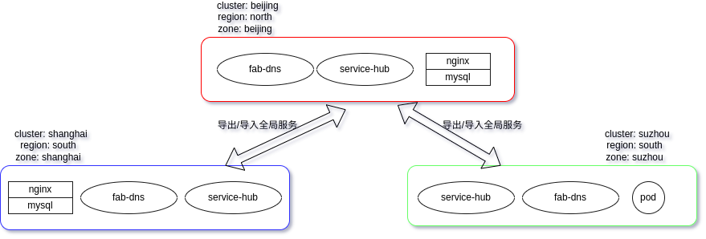

# FabEdge跨集群服务访问

 FabEdge在0.4.0时已经支持多边缘集群通信，但集群间的相互访问只能通过IP来访问，即便访问目标是一个服务也会如此，这与日常中使用Kubernetes的习惯极不相符。事实上，自多集群通信的需求存在以来，跨集群的服务发现和访问的需求就一直存在，开源社区也一直在努力解决这个问题：

* [Multi-cluster Service APIs](https://github.com/kubernetes-sigs/mcs-api)
* [Lighthouse](https://submariner.io/getting-started/architecture/service-discovery/)
* [Cilium Load-balancing & Service Discovery](https://docs.cilium.io/en/stable/gettingstarted/clustermesh/services/)

既然已经存在这些解决方案，为什么FabEdge要提出自己的解决方案呢？有如下原因：

* mcs-api只是一套API，需要其他实现者解决各个集群间服务信息的导出导入。
* Lighthouse依赖于submariner，而submariner并不是面向边缘场景的。
*  Cilium是一套整体解决方案，不能跟其他CNI共存，此外它也不是面向边缘场景。

为FabEdge提供跨集群服务访问的组件叫[FabDNS](https://github.com/FabEdge/fab-dns)，它尝试达成以下目标：

* 它允许一个集群访问其他集群提供的服务，服务类型仅限于ClusterIP，Headless两种。

* 一个服务可以部署于一个集群内部，也可以分散在多个集群里。

* 提供一定的具备拓扑感知的DNS解析，访问者可以就近访问最近的服务节点。    

    
  

FabDNS有两个组件: service-hub与fab-dns。还提供了一个CRD: GlobalService。一个集群若想将一个服务提供给其他集群，首先要将该服务标注为全局服务。 service-hub负责各个集群间全局服务的导出与导入，fab-dns负责在集群内部提供全局服务的地址解析。每个集群部署FabDNS时要标注拓扑信息，即region和zone信息，FabDNS的拓扑感知就是基于这些拓扑信息来进行的。

以上图为例，共有三个集群，北京集群是主集群，上海集群和苏州集群的service-hub都要通过北京集群的service-hub交换全局服务信息。北京和上海集群同时暴露了一个nginx服务和一个mysql服务，假设这些服务都是在default命名空间下。如果上海或北京的一个pod去访问nginx.default.global，那么响应的pod只会是各自集群的pod，因为zone是匹配的。如果苏州集群的pod去访问nginx.default.global，那么它会被上海集群的nginx背后的pod响应，为什么呢？因为苏州和上海的region都是south
