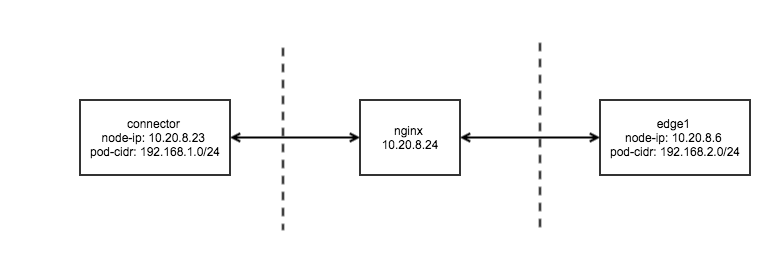

# Use the nginx agent Fabedge-Connector

[toc]

## Context
Connector is a FabEdge cloud component used to terminate IPSec VPN tunnels. It may be necessary to work with a reverse proxy or load balancer for security or other reasons.

## Experimental environment



FabEdge configuration：

```shell
$cat values.yaml
operator:
  connectorPublicAddresses: 10.20.8.24  # address of the nginx agent  
  connectorSubnets: 10.96.0.0/12  
  edgeLabels: node-role.kubernetes.io/edge
  masqOutgoing: true
  enableProxy: false
cniType: flannel
```


Nginx configuration：

```shell
# omit irrelevant configuration
stream {
    upstream isakmp {
        server 10.20.8.23:500;
    }
    upstream ipsec-nat-t {
        server 10.20.8.23:4500;
    }
    server {
        listen 500 udp;
        proxy_pass isakmp;
    }
    server {
        listen 4500 udp;
        proxy_pass ipsec-nat-t;
    }
}
# omit irrelevant configuration
```
> Version：nginx/1.21.4 built by gcc 10.2.1 20210110 (Debian 10.2.1-6)


FabEdge connector@node1status：

```shell
root@node1:~$ docker exec $strong swanctl --list-sas
edge1: #20, ESTABLISHED, IKEv2, 107a2d290f61e317_i b427bcf8f64c43a1_r*
  local  'C=CN, O=fabedge.io, CN=cloud-connector' @ 10.20.8.23[4500]
  remote 'C=CN, O=fabedge.io, CN=edge1' @ 10.20.8.24[46788]
  AES_CBC-128/HMAC_SHA2_256_128/PRF_AES128_XCBC/ECP_256
  established 2074s ago, rekeying in 11460s
  edge1-p2p: #99, reqid 1, INSTALLED, TUNNEL-in-UDP, ESP:AES_GCM_16-128
    installed 2074s ago, rekeying in 1203s, expires in 1886s
    in  c122f842, 1348365 bytes, 16057 packets,     0s ago
    out c61eed02, 1354686 bytes, 16121 packets,     0s ago
    local  10.96.0.0/12 192.168.0.0/24 192.168.1.0/24
    remote 192.168.2.0/24
  edge1-n2p: #100, reqid 2, INSTALLED, TUNNEL-in-UDP, ESP:AES_GCM_16-128
    installed 2074s ago, rekeying in 1292s, expires in 1886s
    in  c1639565,    252 bytes,     3 packets,  1874s ago
    out cc10aa8b,    252 bytes,     3 packets,  1874s ago
    local  10.20.8.23/32 10.20.8.24/32
    remote 192.168.2.0/24
  edge1-p2n: #101, reqid 3, INSTALLED, TUNNEL-in-UDP, ESP:AES_GCM_16-128
    installed 2074s ago, rekeying in 1412s, expires in 1886s
    in  cc45e5a7,      0 bytes,     0 packets
    out c44f7897,      0 bytes,     0 packets
    local  10.96.0.0/12 192.168.0.0/24 192.168.1.0/24
    remote 10.20.8.6/32
    
root@node1:~# ip x p l dst 192.168.2.0/24
src 10.20.8.24/32 dst 192.168.2.0/24
        dir out priority 371327
        tmpl src 10.20.8.23 dst 10.20.8.24
                proto esp spi 0xcc10aa8b reqid 2 mode tunnel
src 10.20.8.23/32 dst 192.168.2.0/24
        dir out priority 371327
        tmpl src 10.20.8.23 dst 10.20.8.24
                proto esp spi 0xcc10aa8b reqid 2 mode tunnel
src 192.168.1.0/24 dst 192.168.2.0/24
        dir out priority 375423
        tmpl src 10.20.8.23 dst 10.20.8.24
                proto esp spi 0xc61eed02 reqid 1 mode tunnel
src 192.168.0.0/24 dst 192.168.2.0/24
        dir out priority 375423
        tmpl src 10.20.8.23 dst 10.20.8.24
                proto esp spi 0xc61eed02 reqid 1 mode tunnel
src 10.96.0.0/12 dst 192.168.2.0/24
        dir out priority 381567
        tmpl src 10.20.8.23 dst 10.20.8.24
                proto esp spi 0xc61eed02 reqid 1 mode tunnel    
```

> Note: on node1, all tunnel peer addresses are 10.20.8.24, which is the address of nginx. 


FabEdge agent@edge1status：

```shell
root@edge1:~# docker exec $strong swanctl --list-sas
cloud-connector: #1, ESTABLISHED, IKEv2, 107a2d290f61e317_i* b427bcf8f64c43a1_r
  local  'C=CN, O=fabedge.io, CN=edge1' @ 10.20.8.6[4500]
  remote 'C=CN, O=fabedge.io, CN=cloud-connector' @ 10.20.8.24[4500]
  AES_CBC-128/HMAC_SHA2_256_128/PRF_AES128_XCBC/ECP_256
  established 2240s ago, rekeying in 12034s
  cloud-connector-p2p: #4, reqid 1, INSTALLED, TUNNEL-in-UDP, ESP:AES_GCM_16-128
    installed 2240s ago, rekeying in 1196s, expires in 1720s
    in  c61eed02, 1459854 bytes, 17373 packets,     0s ago
    out c122f842, 1462941 bytes, 17421 packets,     0s ago
    local  192.168.2.0/24
    remote 10.96.0.0/12 192.168.0.0/24 192.168.1.0/24
  cloud-connector-p2n: #5, reqid 3, INSTALLED, TUNNEL-in-UDP, ESP:AES_GCM_16-128
    installed 2240s ago, rekeying in 1048s, expires in 1720s
    in  cc10aa8b,    252 bytes,     3 packets,  2040s ago
    out c1639565,    252 bytes,     3 packets,  2040s ago
    local  192.168.2.0/24
    remote 10.20.8.23/32 10.20.8.24/32
  cloud-connector-n2p: #6, reqid 2, INSTALLED, TUNNEL-in-UDP, ESP:AES_GCM_16-128
    installed 2240s ago, rekeying in 1141s, expires in 1720s
    in  c44f7897,      0 bytes,     0 packets
    out cc45e5a7,      0 bytes,     0 packets,  2231s ago
    local  10.20.8.6/32
    remote 10.96.0.0/12 192.168.0.0/24 192.168.1.0/24
 
root@edge1:~# ip x p l dst 192.168.1.0/24
src 10.20.8.6/32 dst 192.168.1.0/24
        dir out priority 371327
        tmpl src 10.20.8.6 dst 10.20.8.24
                proto esp spi 0xcc45e5a7 reqid 2 mode tunnel
src 192.168.2.0/24 dst 192.168.1.0/24
        dir out priority 375423
        tmpl src 10.20.8.6 dst 10.20.8.24
                proto esp spi 0xc122f842 reqid 1 mode tunnel   
```

> Note: on edge1, the tunnel peer address to Connector cloud is 10.20.8.24, also known as nginx's address. 


## Experimental result

```shell
root@master:~# kubectl get po -o wide
NAME          READY   STATUS    RESTARTS   AGE   IP            NODE    NOMINATED NODE   
nginx-edge1   1/1     Running   0          62m   192.168.2.7   edge1   <none>           
nginx-node1   1/1     Running   0          62m   192.168.1.7   node1   <none>   

root@master:~# kubectl exec nginx-edge1 -- ip r
default via 192.168.2.1 dev eth0
192.168.2.0/24 dev eth0 proto kernel scope link src 192.168.2.7

root@master:~# kubectl exec nginx-edge1 -- curl -s 192.168.1.7
Praqma Network MultiTool (with NGINX) - nginx-node1 - 192.168.1.7 - HTTP: 80 , HTTPS: 443
```

