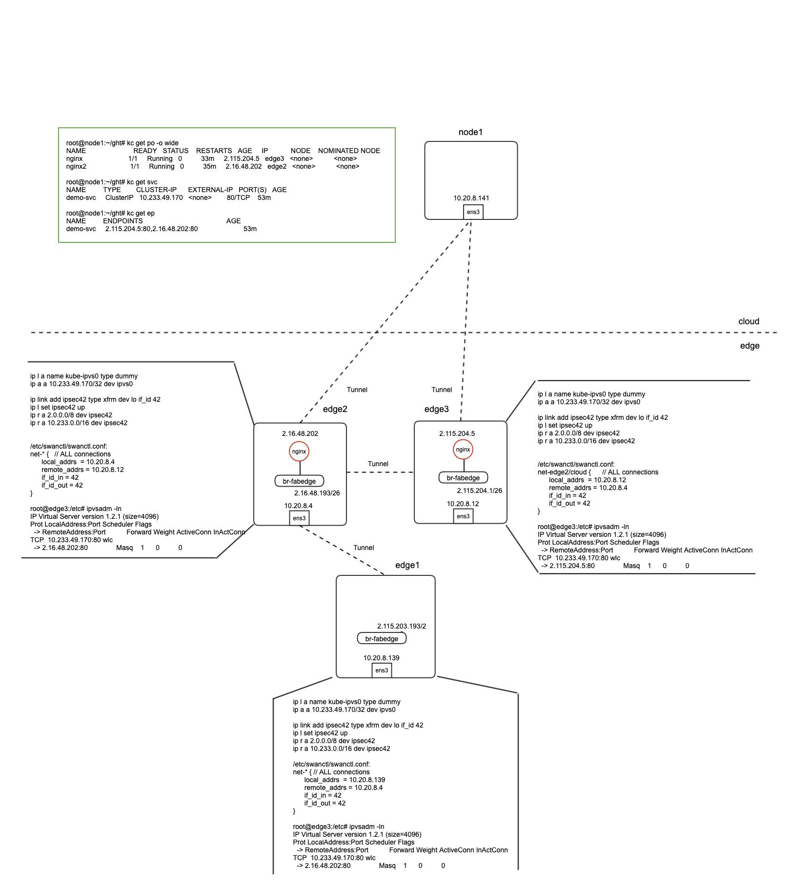

# fab-proxy 设计和POC实验

## 设计原则

 fab-proxy定位为一个轻量的kube-proxy， 运行在边缘节点，解决边缘pod访问service的问题。

- 边缘Pod访问云端的Service， 不论是ClusterIP还是NodePort类型， 都可以直接访问。
- 只考虑边缘Pod访问边缘ClusterIP类型Service，不考虑访问边缘NodePort类型的Service。

边缘节点上，某Service使用的Endpoint(s)，按如下顺序依次选择：

1. 如果本边缘节点上有可用的Endpoint(s)，那么使用本地Endpoint(s)

2. 如果没有启用“UseServiceInCommunity”，使用云端Endpoint(s)

3. 如果启用了“UseServiceInCommunity”， 并且本边缘节点所属Commnity里其它边缘节点有可用的Endpoint(s)， 那么选取这些Endpoint(s)

kube-proxy支持iptables和ipvs两种模式，但ipvs比iptables更好，这里也使用ipvs。

ipvs支持多种调度算法，作为一个配置项：

  * rr - Robin Robin

  * wrr - Weighted Round Robin

  * lc - Least-Connection

  * wlc - Weighted Least-Connection

  * lblc - Locality-Based Least-Connection

  * lblcr - Locality-Based Least-Connection with Replication

  * dh - Destination Hashing

  * sh - Source Hashing

  * sed - Shortest Expected Delay

  * nq - Never Queue

    

## 技术实现

1. 云端控制器监控Service/Endpoint/EndpointSlice， 根据上面的原则，为每个边缘节点的生成相应的配置信息，写入configmap。
2. 边缘节点代理监控相应配置文件，同步本地路由，ipvs配置等。

**注意** EndpointSlice支持 [topology aware hints](https://kubernetes.io/docs/concepts/services-networking/topology-aware-hints/)新特性，性能也更好，优先使用。

## 实验环境

1. 创建一个Service，名字demo-svc， CluserIP是10.233.49.170，端口80。
2. 创建两个Pod， 一个在edge2上， 一个在edge3上， 作为demo-svc的Endpoints。
3. edge1和edge2在一个community； edge2和edge3在一个communtiy。
4. 在edgeX上， 创建一个kube-ipvs0的接口。
6. 在edgeX上，创建一个ipsec42的接口，if_id是42。
7. 添加一条到云端的路由， 10.233.0.0/16， （也就是配置tunnel时，云端对应的subnets）， 到ipsec42的接口上。
8. 添加一条到其它边缘节点的路由，2.0.0.0/16，（也就是给边缘节点从中分小网段的大网段），到ipsec42的接口上。
9. stongswan的每个connection里增加配置if_id_in和if_id_out,  42, 对应步骤6里的if_id。
9. 将CluserIP，10.233.49.170绑定到kube-ipvs0的接口上。
10. 在ipvs里创建vs，使用ClusterIP 10.233.49.170，使用配置的调度算法。
11. 在ipvs里创建rs，使用相应的Endpoint，使用Masq的模式。

**注意：如果一个边缘节点的一个Service只使用云端Endpoint(s),  步骤9-11不需要执行，也不能执行**

## 结果验证
1. 从边缘Pod可以访问任何本地没有的，云端的Service。
2.  在edge2/3上，Pod可以curl 10.233.49.170
3. 在edge1上，Pod可以curl 10.233.49.170